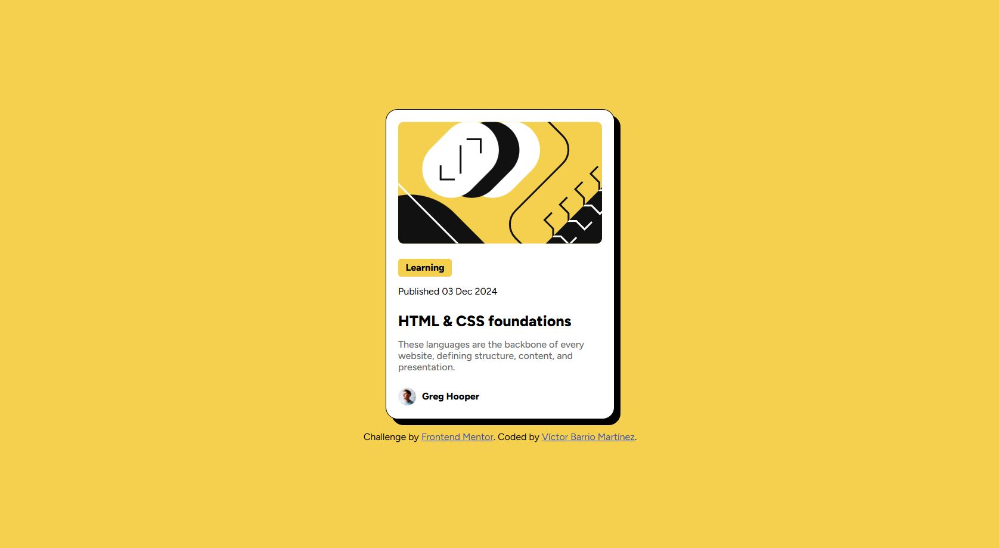

# Frontend Mentor - Blog preview card solution

This is a solution to the [Blog preview card challenge on Frontend Mentor](https://www.frontendmentor.io/challenges/blog-preview-card-ckPaj01IcS). Frontend Mentor challenges help you improve your coding skills by building realistic projects. 

## Table of contents

- [Overview](#overview)
  - [The challenge](#the-challenge)
  - [Screenshot](#screenshot)
  - [Links](#links)
- [My process](#my-process)
  - [Built with](#built-with)
  - [What I learned](#what-i-learned)
  - [Continued development](#continued-development)
  - [Useful resources](#useful-resources)
- [Author](#author)
- [Acknowledgments](#acknowledgments)

## Overview

### The challenge

Users should be able to:

- See hover states for the interactive title element on the page.

### Screenshot

### Links

- Solution URL: [https://github.com/Victor-Barrio/BlogPreviewChallenge]
- Live Site URL: [https://victor-barrio.github.io/BlogPreviewChallenge/]

## My process

### Built with

- Semantic HTML5 markup
- CSS custom properties
- Flexbox
- Mobile-first workflow

### What I learned

I learned the Mobile-first workflow to work on this project, and is a great way to do it. This project give me one problem when I was doing the icon and name of the author section, the flexbox propert didn't work, and when i put the margin to 0 it's woking correctly. I'm learning a lot of things about CSS and HTML, I'm really happy with the result.

### Continued development

I want to continue working with the Mobile-first workflow to made my future projects easier.
